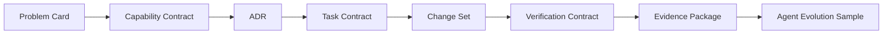

# Architecture

## System Model

Team Forge is organized around a small set of composable primitives:



## Current Packages

`packages/core` owns the domain model:

- `ledger.ts`: append-only event ledger
- `projector.ts`: converts events into typed workspace subspaces
- `admission.ts`: evaluates agent action risk and review requirements
- `context.ts`: builds a task context package from task contracts and code graph slices
- `work-item.ts`: validates stable bug, feature, and new-project source references
- `seed.ts`: stable seed workspace for MVP and UI development

`packages/file-store` is the default local persistence adapter:

- atomically writes versioned Work Context records as JSON;
- rejects unsafe work IDs before resolving filesystem paths;
- implements the core `WorkContextStore` port without adding Node dependencies
  to the browser-facing core package.

`apps/web` owns the first workspace surface:

- six typed subspaces
- code graph projection panel
- task context package strip
- action admission and evidence panel

## Design Choices

- Code-centric: source code remains first truth.
- Projection-based: workspace views are projections of typed events and graph overlays.
- Contract-first: AI actions are checked against explicit task and capability contracts.
- Reuse-first: task context includes reuse candidates before implementation starts.
- Evidence-first: completion is measured by evidence packages, not code changes alone.
- Resumable: work identity, phase, artifacts, graph version, and human gates are
  explicit context rather than hidden chat state.

## SDD Compatibility Direction

Team Forge hosts Spec-driven workflows as projections over its core contracts:

```text
Intake -> Spec -> Plan -> Tasks -> Implement -> Evidence -> PR -> Review
```

Standard mode reviews Plan and Tasks separately. Compact mode still produces
both artifacts but combines their human review for eligible low-risk work. Bug
fixes and features use different work-item rules, while new-project work always
uses Standard mode. See [AI-TEAM-MIGRATION.md](AI-TEAM-MIGRATION.md).

## Later Architecture

The current in-memory seed model should evolve into:

- Code Graph Service
- Task Context Service
- Agent Run Ledger
- Policy & Gate Service
- Evidence Board
- Skill Registry
- Hook Runtime
- Agent Eval & Evolution Service
